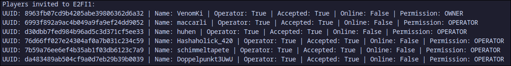

# Python client to interact with Minecraft: Java Edition Realms

## Implemented features

Not all of the API routes are implemented. This was quickly thrown together for a specific purpose, so only the required featureset is implemented. This includes:

*   Get realms of signed-in player
*   Access detailed information on a realm and it's players (see class details below)
*   Join a world to obtain server connection details or start the server if it was down
*   Get current status of realm, including online players

## Classes

### RealmsAPIClient

Attributes:

*   cookies:dict
*   baseUrl:str

### RealmsManager

Attributes:

*   realms:list

### Realm

Attributes:

*   realmID:int
*   ownerName:str
*   ownerUUID:str
*   name:str
*   motd:str
*   state:str
*   maxPlayers:int
*   activeSlot:int
*   member:bool
*   isHardcore:bool
*   playerList:list\[Player\]
*   onlinePlayers:list\[Player\]

When the realm is online, following additional information is available:

*   networkProtocol:str
*   address:str
*   pendingUpdate:bool
*   regionName:str
*   serviceQuality:int

Methods:

*   join(shouldWait: bool) → None
    *   Joins a server. When joining is finished, additional information like server address is available in the object. If a server is offline, calling this method starts the server.
    *   If shouldWait is True, the client calls the method repeatedly until the server is fully started and information can be obtained, otherwise it only tries once
*   updateOnlinePlayers() → None
    *   updates list of currently online players
*   updatePlayerList() → None
    *   updates list of invited players

### Player

Attributes:

*   uuid:str
*   name:str
*   operator:bool
*   accepted:bool
*   online:bool \[Always false for the realm owner! Onlinestatus can only be found through onlinePlayerlist\]
*   permission:str

## Usage

> Currently obtaining an access token is not handled by this client. A valid access token has to be supplied manually.

First, a RealmsAPIClient needs to be instantiated. This object will hold required details to authorize to the API.

```python
accessToken:str = 'abc...' # Valid access token obtained externally. Implementing obtaining is TODO
playerUUID:str = "d30dbb7fed984b96ad5c3d371cf5ee33" # The authoring player's UUID without dashes (-)
username:str = 'huhen' # The authorizing player's username
version:str = '1.21.5' # The client version to use. Decides what servers can be joined.
    
RealmsClient:RealmsAPIClient = RealmsAPIClient(accessToken, playerUUID, username, version)
```

Now you have two options:

### a) Dynamically get a player's realms

For this, a RealmsManager object is used:

```python
# Instantiate a RealmsManager object, passing a RealmsAPIClient object as a parameter
realmsMan:RealmsManager = RealmsManager(RealmsClient)

# The object's realms attribute gets populated with Realm objects:
for realm in realmsMan.realms:
	print(f'{realm.realmID} | {realm.name}')
```

#### b) Manually instantiate a realm

If you don't need to access all of the Realms in a list like RealmsManager offers and you know the realm's ID, you can instantiate a Realm object yourself:

```python
# Parameters: realmID, RealmsAPIClient object
exampleRealm:Realm = Realm(14673773, RealmsClient)

print(f'{exampleRealm.name} | {exampleRealm.owner}')
```

## Examples

### a) Get invited players of all realms:

```python
from RealmsAPIClient import RealmsAPIClient
from RealmsManager import RealmsManager
from Realm import Realm

accessToken:str = 'abc...'
playerUUID:str = "d30dbb7fed984b96ad5c3d371cf5ee33"
username:str = 'huhen'
version:str = '1.21.5'

RealmsClient:RealmsAPIClient = RealmsAPIClient(accessToken, playerUUID, username, version)

realmsMan:RealmsManager = RealmsManager(RealmsClient)
for realm in realmsMan.realms:
	print(f'Players invited to {realm.name}:')
	    
    for player in realm.playerList:
    	print(player)
```

<figure class="image"></figure>

### b) Get usernames of a specific realm's currently online players:

```python
accessToken:str = 'abc...'
playerUUID:str = "d30dbb7fed984b96ad5c3d371cf5ee33"
username:str = 'huhen'
version:str = '1.21.5'

RealmsClient:RealmsAPIClient = RealmsAPIClient(accessToken, playerUUID, username, version)

exampleRealm:Realm = Realm(14673773, RealmsClient)

print(f'Currently online on realm {exampleRealm.name}:')
for player in exampleRealm.onlinePlayers:
	print(player.name)
```

